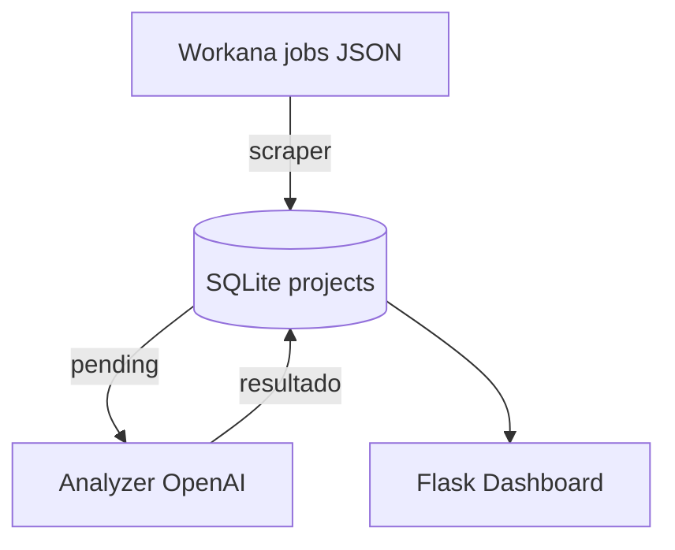
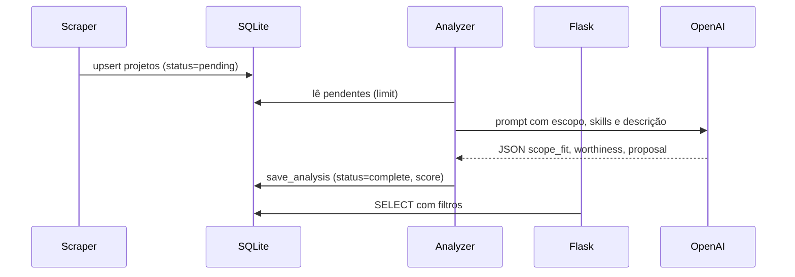

# Workana Radar

Sistema de coleta e qualificação de projetos do Workana que combina scraping, SQLite e agentes da OpenAI para decidir se um projeto está dentro do escopo, se vale a pena e qual proposta sugerir.

## Visão geral
- **Coleta**: baixa listagens do Workana (API usada pelo front) e persiste em SQLite.
- **Análise por IA**: envia projetos pendentes para a OpenAI, retornando campo de escopo, nota de valor e proposta resumida.
- **Painel**: interface Flask leve para filtrar, ler scores e abrir links originais.
- **Persistência**: tabelas enriquecidas registram se o item já passou pela IA, resultado e metadados (modelo, tokens, timestamp).



## Requisitos
- Python 3.11+
- Chave OpenAI (`OPENAI_API_KEY`) para rodar a análise. O scraper e o painel funcionam sem ela (os itens ficam com `analysis_status=pending`).

## Configuração rápida
```bash
make install
cp .env.example .env
# edite .env com sua chave OPENAI
make init-db
```

## Executar
- **Scraping**: `make scrape` (ou `python -m workana.scraper`).
- **Análise por IA**: `make analyze` (ou `python -m workana.analyzer`).
- **Dashboard**: `make serve` e acesse `http://localhost:8000`.

Variáveis principais (todas em `.env` ou exportadas):
- `WORKANA_DB`: caminho do SQLite (default `data/workana.sqlite`).
- `WORKANA_START_URL`, `WORKANA_MAX_PAGES`, `WORKANA_SLEEP`: parâmetros do scraper.
- `WORKANA_SCOPE`: frase de escopo usada no prompt.
- `WORKANA_MODEL`: modelo OpenAI (default `gpt-4o-mini`).
- `OPENAI_API_KEY`: chave para chamadas.

## Estrutura de dados
Tabela `projects` (SQLite) inclui colunas para rastrear IA:
- **analysis_status**: `pending`, `complete` ou `error`.
- **analysis_model**, **analysis_tokens**, **analysis_raw**: rastreabilidade do modelo e resposta.
- **scope_fit**, **worthiness**, **worthiness_reason**, **proposal**: campos retornados pela IA.
- **analysis_checked**: marca se já passou pela OpenAI.
- **score**: métrica simples (valor + bônus se escopo = yes).



## Rotina recomendada
1. `make scrape` para coletar novos projetos.
2. `make analyze` para preencher escopo/valor/proposta.
3. `make serve` para visualizar e filtrar.
4. Repita periodicamente (cron) ou automatize em pipeline CI/CD.

## Documentação adicional
- [Deploy na DigitalOcean](docs/deploy-digital-ocean.md)
- [Como atualizar o código e manter o banco](docs/maintenance.md)

## Troubleshooting rápido
- **Sem chave OpenAI**: análise marca `error` com mensagem "ausente"; configure `OPENAI_API_KEY` e rode `make analyze` novamente.
- **Lista vazia**: aumente `WORKANA_MAX_PAGES` e confira se o site não mudou o endpoint.
- **Dashboard sem dados**: confirme o caminho do banco (`/health` mostra o caminho atual).
